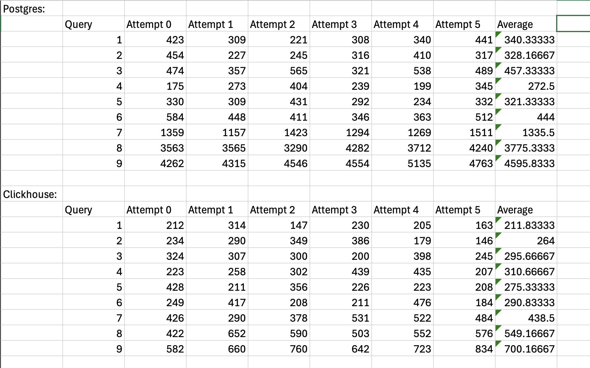

# Data Sources

## Trainee Applied Engineer
- [X] Selects data from a database using query language
    - [Evidence](./evidence/distributed_systems_labs/lab2-3/lab3/clickhouse/queries.sql#L40)

## Junior Applied Engineer
- [X] Orders and groups data from a database using query language
    - [Evidence](./evidence/distributed_systems_labs/lab2-3/lab3/clickhouse/queries.sql#L40)
- [X] Uses database data aggregation techniques to optimise data analysis
    - [Evidence](./evidence/distributed_systems_labs/lab2-3/lab3/clickhouse/queries.sql#L40)
    - 

## Middle Applied Engineer
- [X] Combines multiple queries to optimise query execution
    - [Info](./COMBINING_QUERIES.md)
- [X] Implements and modifies database structure
    - [Evidence](../1_libraries/evidence/orm_example/migration/src/m20220101_000001_create_table.rs)
    - [Evidence](./evidence/distributed_systems_labs/lab2-3/lab2/postgresql/up.sql)
- [X] Wraps queries into transactions to ensure data consistency and integrity
    - [Info](./TRANSACTIONS.md)
